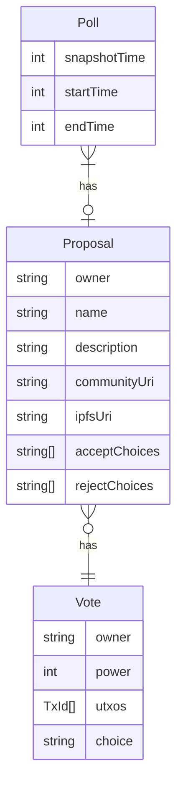
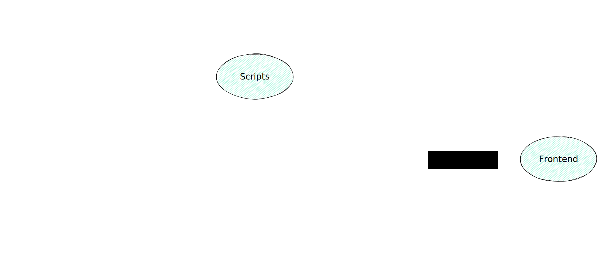
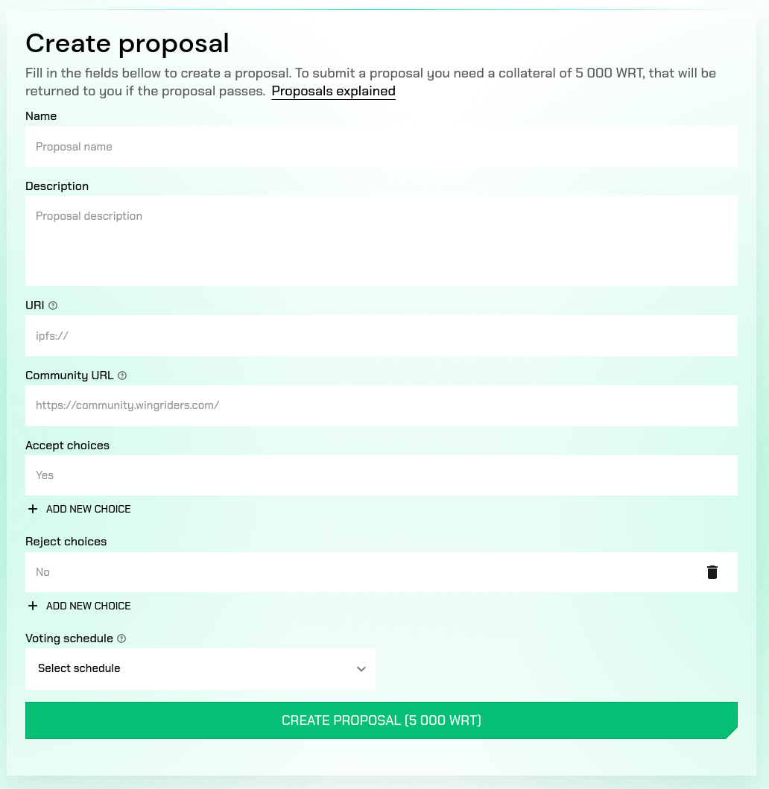
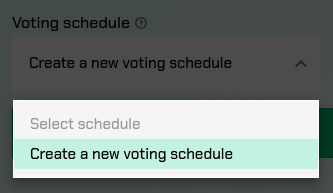
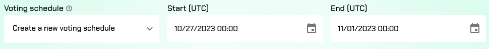
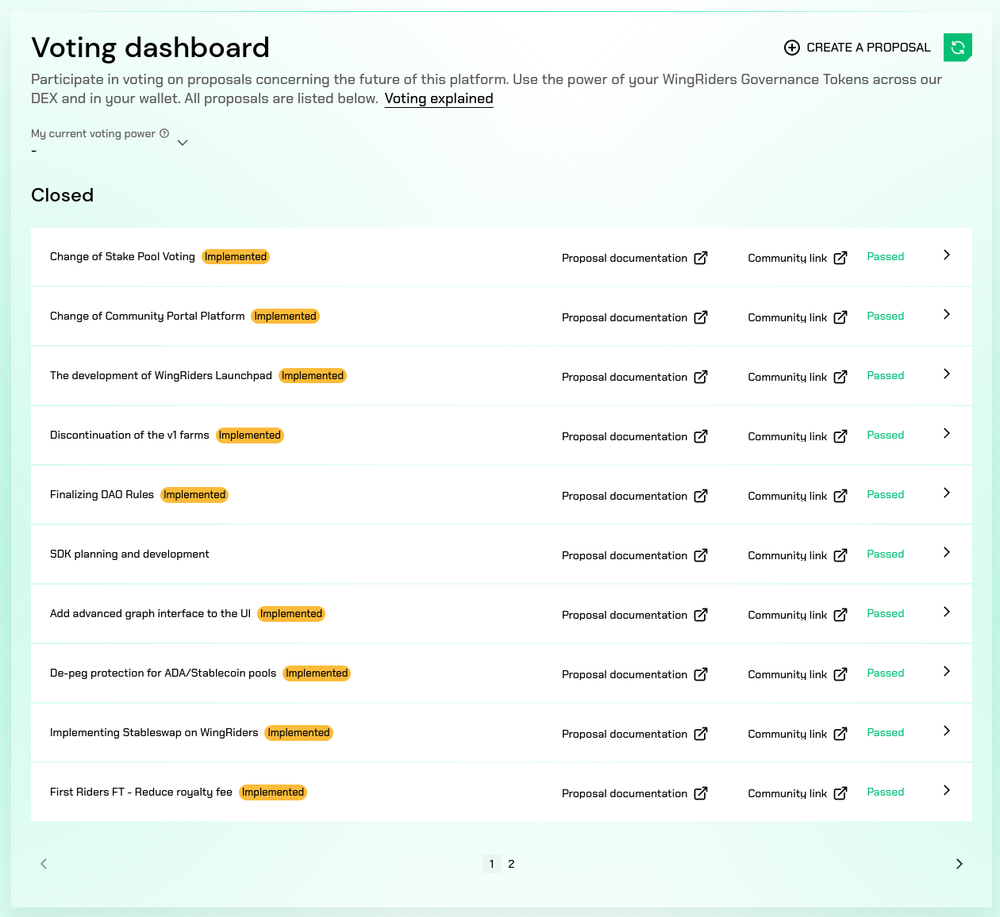
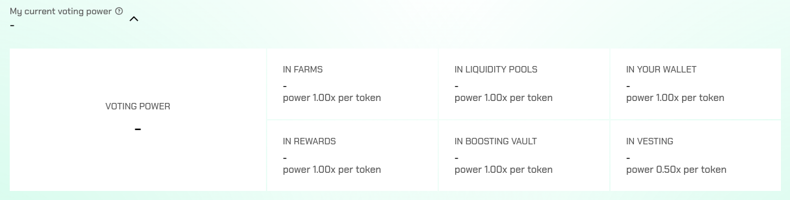
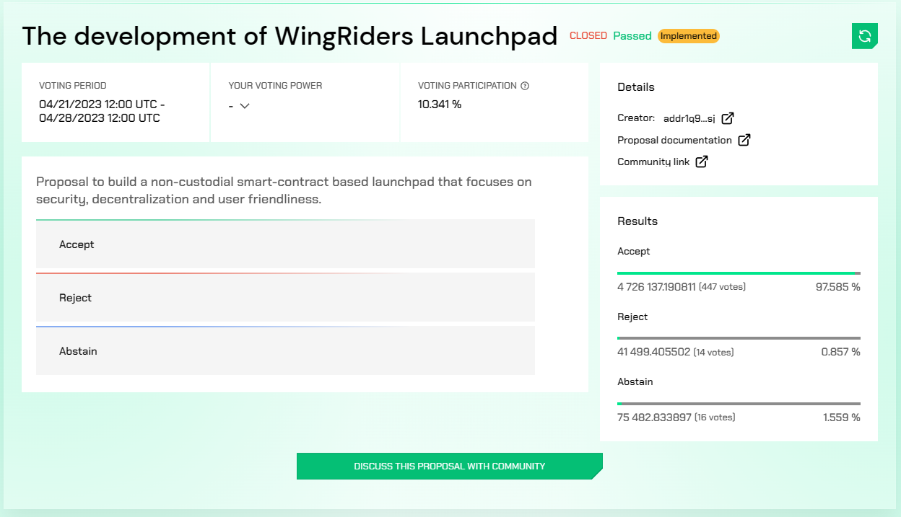
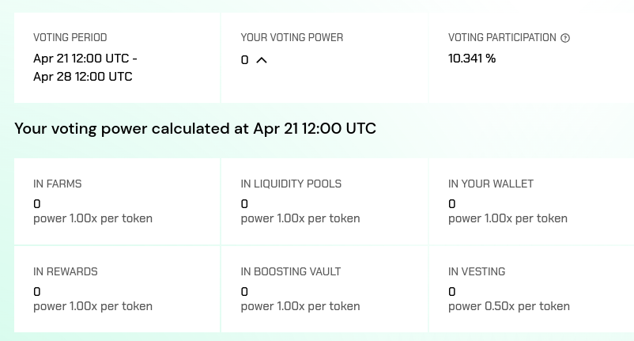

<p align="center"></p>

# Open-Source On-Chain DAO Governance

## Solution Design and Architecture
The DAO Governance solution builds on the following core pillars:
* Open-source
* Fully on-chain
* Transparent and auditable voting
* Built around transaction metadata

It doesn't use smart contracts meaning the results are not enforced. However, the system by being open source and auditable has a safety check that can be run by anyone to verify if the entity is truthful or not. Anybody has the right and way to verify the votes.

Furthermore, not using smart contracts enables the system to be more flexible, for example in terms of what can constitute a user's voting power. It isn't limited to users locking governance tokens to some special voting script or a similar mechanism. It can use the user's governance tokens directly in their wallet, use governance tokens locked in various scripts, or even use LP tokens from DEXes that can be translated in value to the original governance tokens. Being this flexible enables the system to adapt to almost all limitations and specific setups an established dApp might have. Also, thanks to not being based on smart contracts the transaction costs users need to pay are lower.

The system by itself doesn't support any discussions. In the end, it wouldn't be very practical to use the Cardano blockchain for passing messages. However, from the experience of WingRiders and other well-established DAOs, the discussions are best suited for community portals. Therefore the system encourages each proposal to be linked to a specific discussion on the community portal of the project.

### Polls, Proposals and Votes
As mentioned above the system builds around transactions with special metadata. The overall system has three main building blocks - polls, proposals, and votes.

Polls group together multiple proposals and define a voting power snapshot time and the voting timeframe. The voting power snapshot is required to happen before the start of the voting timeframe. This ensures that maximum theoretical voting power doesn’t suddenly change after voting on the proposal has started. Grouping multiple proposals into one poll means a user can submit just one transaction with multiple votes, lowering TX fees, and improving the UX Hopefully this leads to higher participation rates than in many small fragmented separate standalone proposals.

A proposal belongs to exactly one poll and can have multiple votes. On-chain it is defined by transaction metadata - owner, name, short description, accept and reject choices, IPFS link to additional documentation, and link to a community portal. The space to define the proposal on-chain is limited by the transaction size limits, therefore the full documentation is hosted on IPFS.

The vote belongs to exactly one proposal. It identifies the voter, tallies up the voting power, and lists UTxOs used to calculate the voting power.



## Modules
From a technical perspective, the system is built around 4 modules:

* **Backend** - Handles aggregating DAO governance transactions from the blockchain and serving them to other components
* **Scripts** - Suite of scripts for managing proposals from the DAO wallet
* **Library** - Glue between the backend and the fronted with actions to create proposals and cast voted
* **Frontend** - Example white-label UI using the library to connect to a deployed backend

How these modules interact with each other is also described in the following graph of interactions. The blue squares represent external dependencies, green ovals represent individual modules, and green squares important submodules.

<p align="cetner"></p>

### Backend
The backend service is responsible for aggregating governance-related transactions from the blockchain (proposal creation, finalization, cancellation, and votes) and exposing APIs to fetch this data. The architecture splits it into two services:
* First handles the aggregation of data into a PostgreSQL database
* Second is the server counterpart that handles incoming requests and queries data from the PostgreSQL database.

From experience with building backend services at WingRiders, this setup has the advantage of enabling easier horizontal scaling of the server part, which is the one with variable loads.

Both services share the same codebase as for example the DB schema and some utilities are common. The services are differentiated during runtime based on command line arguments.

The external dependencies for both services are
* **Ogmios** - ChainSync for aggregating data, and StateQueryClient to get current blockchain information
* **Kupo** - for querying UTxOs for users’ voting power

> 🔶 With proper encapsulation it might be possible to bring support for additional databases other than PostgreSQL as well as alternatives to Ogmios and Kupo. However, in the initial phase only these will be considered.

#### Configuration
The backend is the only configurable module if we don’t count modifications to the frontend. The configuration determines the parameters of the specific DAO deployment.

The first options that are also exposed via an API call define the general parameters of the deployment, also called DAO Governance Options:
*Governance token
*Proposal creation collateral amount in governance tokens
*DAO wallet address

And then some options have programmatic configuration.

##### Tokens
By default, only the defined governance token is represented in the user’s voting power and his voting UTxOs. However, the project could want to enable users to even use LP tokens from DEXes to vote, or any other token that can have its value “translated” into a governance token. This option enables configuring custom additional tokens and their value translations.

##### Script UTxOs
By default, the DAO system can take into account any UTxOs sharing the user’s stake key hash. However, depending on the application, there might be other UTxOs that need to be considered, such as a staking script of the governance token, farms on DEXes, etc.

This programmatic configuration allows to set up script addresses that should be considered for user voting power and how to proof ownership based on datum schema.

##### Governance token max voting power calculation
Optional, but recommended. For DAO votes usually, there is a certain voting participation required for proposals to pass. To determine the participation the system needs to know the maximum voting power. By default, this calculation just takes into account the total amount of governance tokens minted. However, a project could want to take into account its own tokenomics and modify this to more accurately reflect the available max voting power.

#### Aggregation Service
The aggregation service connects to the blockchain using Ogmios ChainSync. It aggregates data around DAO governance from on-chain transactions to a custom PostgreSQL schema. The different types of transactions getting aggregated are:
* Poll and proposal creation transactions
* Proposal conclusion
* Proposal cancelation
* Vote casts

The first three all either have outputs or spend outputs on the defined DAO wallet, so they are easy to aggregate. The vote casts are transactions users send to their own wallets with specific metadata and signed by their staking key, all of these identifiers are used to locate such transactions on the blockchain.

##### Vote validation
In addition to simple aggregation the backend also needs to validate votes. This process is deferred from the main aggregation loop as it can be more time-consuming to validate a vote with all of the referenced voting power UTxOs a user might have. Therefore, there is a periodical vote validation job running, which validates any new votes asynchronously.

#### API Service
API calls just retrieve data from the PostgreSQL database that gets aggregated by the aggregation service. No transactions or data are submitted through the API.

##### `GET /api/options`
**Inputs:** None

**Returns:** DAO Governance options from configuration. (These are mainly needed when creating a proposal)

##### `GET /api/maxVotingPower`
**Inputs:** (optional) slot

**Returns:** Theoretical max voting power for the given governance deployment calculated as configured. If the slot is specified then the voting power is a historical snapshot for the given slot.

##### `GET /api/userVotingPower`
**Inputs:** User’s stake key hash, (optional) slot

**Returns:** List of UTxOs defining the user’s voting power selected from the configured set of UTxO sources, grouped by source, and the total tally of the user’s voting power. If the slot is specified then the voting power is a historical snapshot for the given slot.

##### `GET /api/proposals`
**Inputs:** None

**Returns:** List of proposals, with their ID, name, and status (ongoing, passed, or failed)

##### `GET /api/proposal`
**Inputs:** proposal ID

**Returns:** Details about the proposal, plus the current up-to-date results JSON from validated votes

Example results JSON taken from a successful WingRiders DAO proposal:
```json
{
  "result": "PASSED",
  "choices": {
    "Keep the current threshold, use WRM01 as the default stake pool": "77393892650",
    "Set a new threshold to 20%, use WRM01 as the default stake pool": "507340931932",
    "Set a new threshold to 15%, use WRM01 as the default stake pool": "2170480038747",
    "Do not apply any changes": "19615169268"
  },
  "abstained": "346271114327",
  "total": "3121101146924",
  "note": "'Set a new threshold to 15%, use WRM01 as the default stake pool' has won"
}
```

### Scripts
Simple off-chain command line utility to manage proposals using the DAO wallet. A proposal is just a UTxO in the DAO wallet. Managing the proposal therefore means spending it in various ways, the action distinguished by the transaction metadata. The script takes as a configuration the mnemonic to the assigned DAO wallet and based on the selected action spends the proposal UTxO accordingly.

#### Actions

##### Cancel proposal
**Inputs:**
* Proposal txHash
* Cancellation reason
* Beneficiary - address where the collateral for creating a proposal should be sent\

This creates a transaction spending the proposal UTxO with metadata specifying the “Cancel Proposal” action and the reason for cancellation. The governance tokens collateral is sent to the beneficiary.

##### Finalize proposal
**Inputs:**
* Proposal txHash
* Results JSON (can be obtained from /api/proposal endpoint)
* Beneficiary - address where the collateral for creating a proposal should be sent.

This creates a transaction spending the proposal UTxO with metadata specifying the “Conclude Proposal” action and other fields parsed from the results JSON. The overall result can be either that the proposal passed or failed depending on if the proposal met the participation criteria. The metadata further includes a final tally of the validated votes. The governance tokens collateral is sent to the beneficiary.

### Library
The library is not specific to one deployment of the governance framework. It gets the required configuration options and deployment-specific data from the backend which acts as the configuration store. This enables the library and associated example white-label UI to be easy to deploy without any additional manual build steps needed.

The library acts as an SDK to support querying backend data and creating governance actions - specific on-chain transactions. It acts as a de facto glue between the backend and frontend.

The library is initialized with the URL for the backend service. From backend, it pulls the configuration of the specific DAO governance deployment and then the library becomes initialized and exposes the following calls.

#### Exposed calls

##### Action - Create a proposal
Action to create a proposal in an on-chain transaction with specific metadata.

**Inputs:** Proposal and poll metadata

This action creates a new proposal using an on-chain transaction. The output with the proposal creation collateral paid in governance tokens is sent to the DAO address. The proposal and poll are defined using the transaction metadata.

When creating a proposal the user has the option to create a new poll or reuse an existing one, in case a poll in the future exists.

Sample transaction metadata for creating a proposal with a new poll:
```json
{
  "op": "addProposal",
  "poll": {
    "op": "create",
    "end": 1688731200000,
    "start": 1687867200000,
    "snapshot": 1687867200000,
    "description": ""
  },
  "proposal": {
    "uri": "ipfs://QmUjmC9Pk5h9micdtce2kP1PU9iLort2B9cBmJSuJ52Zz1",
    "name": "Change of Community Portal Platform",
    "owner": "014670db61e18fda86bc547a9ada3824d5358bc3cd5878f6dd5d113047d097ab2804f2bfae3c585d58f1cb1b8797e8297fecb0412a1b73adc0",
    "description": [
      "Proposal to change the platform for the community portal to Disc",
      "ourse."
    ],
    "communityUri": "https://community.wingriders.com/feedback/88272",
    "acceptChoices": [
      "Accept"
    ],
    "rejectChoices": [
      "Reject"
    ]
  }
}
```

Sample transaction metadata for creating a proposal and assigning it to an existing poll (the poll is identified by the transaction hash of its creation transaction):
```json
{
  "op": "addProposal",
  "poll": {
    "id": "7a70f8fe21707a2864bf3597ba73727a834f55d2ec49650871e6d571aec6acaf",
    "op": "assign"
  },
  "proposal": {
    "uri": "ipfs://QmTXYBBSgCaBG6n9tbC74QLk5TZeNtNyynNoDFLffy3ps8",
    "name": "Change of Stake Pool Voting",
    "owner": "014670db61e18fda86bc547a9ada3824d5358bc3cd5878f6dd5d113047d097ab2804f2bfae3c585d58f1cb1b8797e8297fecb0412a1b73adc0",
    "description": [
      "Proposal based on the community's feedback on how to improve the",
      " stake pool voting."
    ],
    "communityUri": "https://community.wingriders.com/feedback/76851",
    "acceptChoices": [
      "Keep the current threshold, use WRM01 as the default stake pool",
      "Set a new threshold to 20%, use WRM01 as the default stake pool",
      "Set a new threshold to 15%, use WRM01 as the default stake pool"
    ],
    "rejectChoices": [
      "Do not apply any changes"
    ]
  }
}
```

##### Action - Cast a vote
Action to cast a vote in an on-chain transaction.

**Inputs:** Proposal TX hash, selected vote option, wallet connector API

This action fetches the user’s voting power from the backend and then constructs an on-chain voting transaction. The transaction is sent to user’s own wallet and the vote itself is cast using a specific transaction metadata that lists the voting power UTxOs, the proposal TX hash, and the selected vote option.

Example metadata of a voting transaction
```json
{
   "9a14979b668a2a81b9c410e67abacafb1e57ddee969b018ae2b6f0e540331cd3": {
      "owner": "01a6759239805f2f8bf752f58efbcb13d5c1709376213ca6efa295639c38e2d045ded08dba428615f270bfe9d3b4370b1c903df231bf5c92c7",
      "power": 10000000,
      "utxos": [
         [
            "0ed7fe04ac5586b684c245ccb5fcc6dde52e94bafca647a1afb82e630596333c",
            2
         ],
         [
            "e88b60842387a28c9acd77a2109514e4938852d1972ef854d7292190c100814c",
            2
         ],
         [
            "13a4f3f8105e005be991862108893ddc0768c9488f1f366b4f759c44bd2bf3c4",
            0
         ]
      ],
      "choices": {
         "2512e949de9d8d170c4b5b46ffea036edd95b2b6966c731df4cdb09ddb20c80c": 0,
         "9a14979b668a2a81b9c410e67abacafb1e57ddee969b018ae2b6f0e540331cd3": 0
      }
   }
}
```
The first key defines the poll id that the user is casting his vote for. Then globally for the poll user’s voting power and its source UTxOs are defined and then follow the user’s voting choices.

##### Fetchers
Well-typed fetchers for all 5 endpoints exposed by the backend, each as a separate method:
* `/api/options` - `fetchOptions`
* `/api/maxVotingPower` - `fetchMaxVotingPower`
* `/api/userVotingPower` - `fetchUserVotingPower`
* `/api/proposals` - `fetchProposals`
* `/api/proposal` - `fetchProposal`

### Frontend
This module outlines how the frontend currently looks for WingRiders DAO voting. It for example shows the different sources of voting power that are possible to configure and how they show for the user. This is a breakdown of the necessary screens and flows to provide a functioning UI. The resulting frontend will comply with the outlined functionalities but will differ in the UI to offer a white-label option for all interested projects.

#### UI Flow Documentation: Create Proposal Screen
<p align="center">



</p>

**Screen Title:** Create Proposal

**Purpose:** This screen allows users to create a proposal. To submit a proposal, a collateral of X governance tokens is required. If the proposal passes, this collateral will be returned to the user.

**Fields & Elements Description:**
1. **Name**
    * **Type:** Text input field
    * Placeholder: Proposal name
    * Purpose: To specify the name or title of the proposal.
2. **Description**
    * **Type:** Text area input field
    * **Placeholder:** Proposal description
    * **Purpose:** To provide a brief description or details about the proposal.
3. **URI**
    * **Type:** Text input field with an information icon
    * **Placeholder:** ipfs://
    * **Popup:** Proposal documentation needs to be in ipfs:// link form to guarantee tamper resistance.
    * **Purpose:** To input the unique resource identifier, linked to a file or content related to the proposal and describing it in detail.
4. **Community URL**
    * **Type:** Text input field with an information icon
    * **Placeholder:** COMMUNITY LINK
    * **Popup:** Each proposal needs to have a corresponding community discussion on COMMUNITY LINK for users to easily discuss this proposition.
    * **Purpose:** To provide a link to the community or discussion platform relevant to the proposal.
5. **Accept choices**
    * **Type:** Radio button options
    * **Default Option:** Yes
    * **Additional Option:** User can add more choices by clicking on "ADD NEW CHOICE"
    * **Purpose:** To specify the options community members can choose to accept the proposal.
6. **Reject choices**
    * **Type:** Radio button options
    * **Default Option:** No
    * **Additional Option:** User can add more choices by clicking on "ADD NEW CHOICE"
    * **Purpose:** To specify the options community members can choose to reject the proposal.
7. **Voting Schedule Dropdown**
    * **Type:** Dropdown menu with an information icon
    * **Placeholder:** Create a new voting schedule
    * **Options:**
      * "Select schedule"
      * "Create a new voting schedule"
    * **Purpose:** Choose a voting time frame.
    * **Sub-fields:**
      1. **Start (UTC)**
          * **Type:** Timestamp with edit icon
          * **Example:** 10/27/2023 00:00
          * **Purpose:** Denotes the voting commencement.
      2. **End (UTC)**
          * **Type:** Timestamp with edit icon
          * **Example:** 11/01/2023 00:00
          * **Purpose:** Denotes the voting conclusion.
8. **Create Proposal Button**
    * **Type:** Button
    * **Label:** CREATE PROPOSAL (X governance tokens)
    * **Purpose:** To submit the proposal once all the necessary fields are filled out. The label indicates that a collateral is required to create the proposal.

#### UI Flow Documentation: Voting Dashboard
<p align="center">


</p>

**Page Title:** Voting dashboard

**Purpose:** This dashboard allows users to participate in voting on proposals concerning the platform's future. Users employ their Governance Tokens locked across the platform and in their wallet to vote.

**Fields & Elements Description:**
1. **Voting dashboard Header:**
    * **Text:** Encourages users to participate in voting and introduces the platform's governance mechanism.
2. **"CREATE A PROPOSAL" Button:**
    * **Type:** Button
    * **Purpose:** Redirects users to a page where they can submit a new proposal.
3. **My current voting power Dropdown:**
    * **Type:** Dropdown menu with an information icon
    * **Placeholder:** Displays the user's current voting power
    * **Popup:** Your voting power is calculated from your direct and indirect ownership of Governance Tokens across the whole platform. Direct ownership includes Governance Tokens in your wallet, boosting vault, unclaimed farming rewards and in vesting, while indirect ownership includes liquidity tokens from pools with Governance Tokens either in your wallet or locked in farms.
    * **Purpose:** Provides detailed information on the user's voting capacity from different sources (e.g., IN FARMS, IN LIQUIDITY POOLS, etc.)
4. **Closed Proposals Section:**
    * **Type:** List of completed proposals
    * **Status Indicators:** Implemented, Passed, Rejected
    * **Links:** Proposal documentation (document icon) and community link (link icon)
    * **Purpose:** Displays already created proposals and their results.
5. **Proposal Entries:**
    * Each proposal has:
      * **Title:** Describes the proposal's subject.
      * **Status:** Indicates if the proposal was implemented or not.
      * **Documentation Link:** Provides detailed information about the proposal.
      * **Community Link:** Redirects to the related community discussion.
6. **Voting Power Details:**
    * **Sections:**
      * VOTING POWER (user's total voting power)
      * IN FARMS (voting power sourced from farming)
      * IN LIQUIDITY POOLS (voting power sourced from liquidity pools)
      * IN YOUR WALLET (voting power in the user's direct possession)
      * IN REWARDS (voting power sourced from rewards)
      * IN BOOSTING VAULT (voting power from boosting vault)
      * IN VESTING (voting power from vested tokens)
      * Note: Only “In your wallet” is supported out of the box without extra configuration. The other sources show how WingRiders DAO deployment handles multiple sources for the final voting power
    * **Power Ratio:** Describes the power of each token, e.g., 1.00x per token, indicating how much voting weight each token holds.
    * **Purpose:** Breaks down the user's total voting power into different categories, helping them understand the origin of their influence.
7. **Pagination Controls:**
    * **Type:** Navigation arrows and page numbers
    * **Purpose:** Allows users to navigate between multiple pages of proposals.

#### Page Description: "Proposal details"
<p align="center">


</p>

1. **Proposal Header:**
    * **Title:** A bold title representing the main theme of the proposal.
    * **Status Indicators:** Indications of whether the proposal is "Closed", whether it was "Passed" or maybe “Rejected” and a tag indicating its implementation status ("implemented").
2. **Voting Information:**
    * **Voting Period:** Specifies the start and end date and time for the voting duration.
    * **Your Voting Power:** A dropdown, indicating an individual's potential influence on the vote based on their token holdings or other metrics.
    * **Voting Participation:** Percentage representation of how many eligible participants took part in the vote.
      * **Popup:** Calculated from theoretical max voting power (MAX VALUE) and total participated voting power (ACTUAL VALUE).
3. **Proposal Description:**
    * A concise summary that provides a brief overview of the proposal's intent or objective.
4. **Voting Options:**
    * Buttons for members to choose from the allowed options chosen when submitting the proposal. Also includes the "Abstain" option.
5. **Details Sidebar:**
    * **Creator:** Information about who proposed the idea, with a link to their wallet.
    * **Proposal Documentation:** A link directing to more in-depth information or documentation about the proposal.
    * **Community Link:** A link that leads to further discussions or resources related to the proposal.
    * **Results:** A breakdown of the voting results, presented in both numeric and percentage formats for each of the three voting options.
6. **Community Discussion Action Button:**
    * Action button to take the use to a space where community members can post comments, share thoughts, or discuss the proposal.
