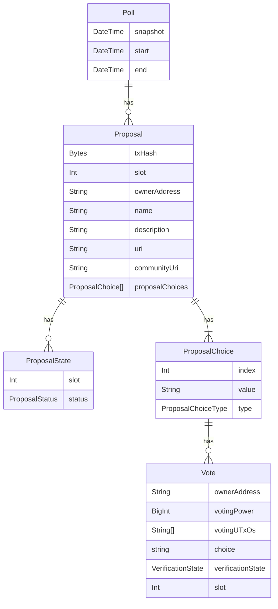

<p align="center"></p>

[](https://github.com/prettier/prettier)

# Open-Source On-Chain DAO Governance

On-chain, decentralized, and auditable governance solution for Cardano. Our framework empowers projects with seamless community governance, enhancing transparency and trust for the project.

## Get started

To initiate DAO governance solution, follow these steps:

1. **Governance token**: You will need a governance token that will represent voting power in your DAO. If you don't have a governance token, mint one using services like https://cardano-native-token.com/ or https://minter.wingriders.com/.
2. **Update Token Metadata Registry**: Ensure your governance token's metadata is up-to-date in the Cardano Metadata Registry. If it's not listed, submit your token's metadata for inclusion: https://developers.cardano.org/docs/native-tokens/token-registry/how-to-submit-an-entry-to-the-registry/

### Build from source

Prerequisites:

- Yarn
- Docker

Prepare yarn environment:

```bash
yarn set version 3.2.4
yarn plugin import workspace-tools
```

Fetch the latest config files for Cardano node we use from cardano-configurations repo.
You should have these configurations in the folder cardano-configurations/:

```bash
git clone git@github.com:WingRiders/cardano-configurations.git
```

This repo is kept up-to date, so feel free to pull new changes from time to time.

Run backend with all required services:

```bash
cd docker/
cp .env.example .env # Change any settings you wish; the defaults should do just fine
```

#### Settings for Kupo

Set the governance token for Kupo to know which transactions to sync:

```dotenv
GOVERNANCE_TOKEN_POLICY_ID=<hex_string>
GOVERNANCE_TOKEN_ASSET_NAME=<hex_string>
```

Set the slot and hash of the block for the minting transaction of the governance token. We are not interested in syncing blocks before that slot:

```dotenv
KUPO_SINCE_SLOT=<number>
KUPO_SINCE_HEADER_HASH=<hex_string># Block hash at KUPO_SINCE_SLOT
```

Start the `cardano-node`, `ogmios`, `kupo`, `governance-db`, `governance-aggregator` and `governance-server` services.

```bash
COMPOSE_PROJECT_NAME=governance docker-compose up -d cardano-node ogmios kupo governance-db governance-aggregator governance-server
```

If you are starting the cardano-node for the first time it will take some time to sync all the blocks, so it's recommended to leave it running overnight, and then you should be good to go. Check the cardano-node sync status and ogmios health at `http://localhost:1338`. Check the kupo sync status at `http://localhost:1442/health`.

## Development roadmap

- [x] Backend
  - [x] Data aggregation
  - [x] API endpoints
  - [x] Configurable tokens and script UTxO sources
- [x] Library
- [x] Dockerfile for backend and `docker-compose` with all required services for running the backend
- [x] Documentation
- [x] Frontend
  - [x] React SDK
  - [x] Example React application

## Solution Design and Architecture

Our DAO Governance solution is grounded in these key principles:

- **Open-Source**: Ensuring accessibility and community-driven enhancements.
- **Fully On-Chain**: All operations, including voting, are recorded on the blockchain for transparency.
- **Transparent and Auditable Voting**: Anyone can verify vote integrity, ensuring trust in the governance process.
- **Based on Transaction Metadata**: Utilizes blockchain metadata for governance actions.

Key Features:

- **No Smart Contracts**: This design choice avoids enforced outcomes, allowing manual verification of results for authenticity.
- **Flexible Voting Power Definition**: Voting power can be determined by various assets, including directly held governance tokens, tokens in scripts, or LP tokens from DEXes. This flexibility caters to diverse dApp requirements and lowers transaction costs.
- **External Discussion Platforms**: While the system doesn't support on-chain discussions, it integrates with external community portals for proposal deliberations, enhancing the governance process.

### Polls, Proposals and Votes

Our system hinges on three key elements: polls, proposals, and votes, each defined using transaction metadata.

Polls group together multiple proposals and define a voting power snapshot slot and the voting timeframe. The voting power snapshot is required to happen before the start of the voting timeframe. This ensures that maximum theoretical voting power doesn't suddenly change after voting on the proposal has started. Grouping multiple proposals into one poll means a user can submit just one transaction with multiple votes, lowering TX fees, and improving the UX Hopefully this leads to higher participation rates than in many small fragmented separate standalone proposals.

A proposal belongs to exactly one poll and can have multiple choices and multiple votes for the choices. On-chain it is defined by transaction metadata - owner, name, short description, accept and reject choices, IPFS link to additional documentation, and link to a community portal. The space to define the proposal on-chain is limited by the transaction size limits, therefore the full documentation is hosted on IPFS. There is a script for changing state of the proposal - this is represented by appending ProposalState entries making this representation immutable. There are four possible states: AVAILABLE, CANCELLED, PASSED, FAILED.

The vote belongs to exactly one proposal and one choice of that proposal. It identifies the voter, tallies up the voting power, and lists UTxOs used to calculate the voting power.



## Modules

From a technical perspective, the system is built around 3 modules:

- **Backend** - Aggregates DAO governance transactions from the blockchain, validates voting power, and provides data to other modules.
- **Library** - Glue between the backend and the frontend with actions to create proposals, cast votes, and managing proposals with the DAO wallet
- **Frontend SDK** - SDK for a React application that provides a set of hooks for fetching data and creating actions

How these modules interact with each other is also described in the following graph of interactions. The blue squares represent external dependencies, green ovals represent individual modules, and green squares important submodules.

<p align="center"></p>

### Backend

The backend is split into two core services, both sharing the same codebase but differentiated at runtime via environment variables:

- **Data Aggregator**: Gathers governance-related transactions (proposals, votes, etc.) and stores them in a PostgreSQL database.
- **API Server**: Handles requests and queries the PostgreSQL database to retrieve data.

This setup, inspired by our experiences at WingRiders, allows for more efficient horizontal scaling of the server part to manage variable loads.

External dependencies

- **Common**
  - **Fastify** - Web framework for API endpoints (Aggregator exposes only healthcheck and transaction evaluation endpoints).
  - **Postgres** - Relational database for storing aggregated data.
  - **Prisma** - ORM for database queries and migrations
  - **Ogmios** - ChainSync for aggregating data, StateQueryClient to get current blockchain information, TransactionSubmissionClient for evaluation of transactions
- **Aggregator specific**
  - **Kupo** - Querying UTxOs to determine user voting power

> 🔶 With proper encapsulation it might be possible to bring support for additional databases other than PostgreSQL as well as alternatives to Ogmios and Kupo. However, in the initial phase only these will be considered.

#### Configuration

The backend is the only configurable module if we don’t count modifications to the frontend. The configuration determines the parameters of the specific DAO deployment.

Configuration options, accessible through an API call, include:

- **Governance token** Policy ID, asset name and total minted amount
- **Proposal collateral** Required amount in governance tokens for creating proposals
- **DAO wallet address** Proposal creation transaction has output on this address

Additional configurations are programmable, ensuring flexibility for various deployment needs.

##### Tokens

By default, only the defined governance token is represented in the user’s voting power and his voting UTxOs. However, the project could want to enable users to even use LP tokens from DEXes to vote, or any other token that can have its value “translated” into a governance token. `VotesDistribution` interface enables configuring custom additional tokens and their value translations.

##### Script UTxOs

The system inherently considers UTxOs linked to a user's stake key hash. Depending on the application, configuration can include additional UTxOs, like staking scripts or DEX farms.

`VotesDistribution` interface allows specifying script addresses for voting power calculations and ownership verification guided by the datum schema.

##### Governance token max voting power calculation

Optional, but recommended. For DAO votes usually, there is a certain voting participation required for proposals to pass. To determine the participation the system needs to know the maximum voting power. By default, this calculation just takes into account the total amount of governance tokens minted. However, a project could want to take into account its own tokenomics and modify this to more accurately reflect the available max voting power. The backend uses a `VotesDistribution` interface to choose the implementation of the max voting power calculation. By default, the `WalletVotesDistribution` is used, which considers all possible tokens. Developers using this repository are encouraged to write their own interface implementations if they need a custom logic (e.g. excluding tokens from a treasury).

##### User voting distribution calculation

It's provided by the `VotesDistribution` interface as well. By default, only tokens from users' wallets are considered at a given slot.

#### Aggregation Service

The aggregation service connects to the blockchain using Ogmios ChainSync. It aggregates data around DAO governance from on-chain transactions to a custom PostgreSQL schema. The different types of transactions getting aggregated are:

- Poll and proposal creation transactions
- Proposal conclusion
- Proposal cancellation
- Vote casts

The first three all either have outputs or spend outputs on the defined DAO wallet address, so they are easy to aggregate. The vote casts are transactions users send to their own wallets with specific metadata and signed by their staking key, all of these identifiers are used to locate such transactions on the blockchain.

##### Vote validation

In addition to simple aggregation the backend also needs to validate votes. This process is deferred from the main aggregation loop as it can be more time-consuming to validate a vote with all the referenced voting power UTxOs a user might have at the snapshot slot. Therefore, there is a periodical vote validation job running, which validates any new votes asynchronously.

#### API Service

API calls just retrieve data from the PostgreSQL database that gets aggregated by the aggregation service. No transactions or data are submitted through the API.
See backend/src/server/routes.ts for the route definitions.

##### `GET /params`

**Inputs:** None

**Returns:** DAO Governance options from configuration. (These are mainly needed when creating a proposal)

##### `GET /protocolParameters`

**Inputs:** None

**Returns:** Protocol parameters of the Cardano network, used when creating transactions.

##### `GET /proposals`

**Inputs:** None

**Returns:** List of proposals, with their ID, name, and status (ongoing, passed, or failed)

##### `GET /activeProposalsCount`

**Inputs:** None

**Returns:** Count of ongoing proposals

##### `POST /userVotableProposalsCount`

**Inputs:** User’s stake key hash

**Returns:** Count of ongoing proposals with no vote cast by the user

##### `GET /theoreticalMaxVotingPower`

**Inputs:** None

**Returns:** Theoretical max voting power for the given governance deployment calculated as configured.

##### `POST /votes`

**Inputs:** List of proposal ids (proposalTxHashes)

**Returns:** Voting power and vote count per verification state, choice and proposal

##### `POST /userVotes`

**Inputs:** User’s stake key hash, list of proposal ids (proposalTxHashes)

**Returns:** Voting power, verification state and choice of the vote case by the user, per proposal

##### `POST /userVotingDistribution`

**Inputs:** User’s stake key hash, (optional) slot

**Returns:** List of UTxOs defining the user’s voting power selected from the configured set of UTxO sources, grouped by source, and the total tally of the user’s voting power. If the slot is specified then the voting power is a historical snapshot for the given slot.

##### `POST /proposal`

**Inputs:** proposal ID (txHash)

**Returns:** Details about the proposal, plus the current up-to-date results JSON from validated votes

Example results JSON taken from a successful WingRiders DAO proposal:

```json
{
  "status": "PASSED",
  "choices": {
    "Keep the current threshold, use WRM01 as the default stake pool": "77393892650",
    "Set a new threshold to 20%, use WRM01 as the default stake pool": "507340931932",
    "Set a new threshold to 15%, use WRM01 as the default stake pool": "2170480038747",
    "Do not apply any changes": "19615169268"
  },
  "abstained": "346271114327",
  "total": "3121101146924",
  "note": "'Set a new threshold to 15%, use WRM01 as the default stake pool' has won"
}
```

##### `POST /paidFees`

**Inputs:**

- Filter (optional)
  - fromSlot (optional, defaults to the slot of the first transaction)
  - toSlot (optional, defaults to the slot of the last transaction)

**Returns:** Total paid transaction fees for proposals management (create, cancel, conclude) and for voting.

### Library

Documentation of the library can be found in its [README file](./sdk/README.md).

### Frontend

If you are building your frontend in React, we've prepared `@wingriders/governance-frontend-react-sdk` library that provides a set of helper functions for data fetching and blockchain interactions. Check it's [README](./frontend/react/sdk/README.md) for more details. We've also built an example application with React that uses `@wingriders/governance-frontend-react-sdk` and showcases all features of the On-Chain DAO Governance, you can check it out [here](./frontend/react/example/README.md).

If you are not using React, you can build your own UI according to your tech-stack and use the [API](#api-service) and [Library](#library) to communicate with the backend or create actions.

<p align="center">
<a href="https://www.wingriders.com/">WingRiders</a> ·
<a href="https://community.wingriders.com/">Community Portal</a> ·
<a href="https://twitter.com/wingriderscom">Twitter</a> ·
<a href="https://discord.gg/t7CdyhK8JA">Discord</a> ·
<a href="https://medium.com/@wingriderscom">Medium</a>
</p>
